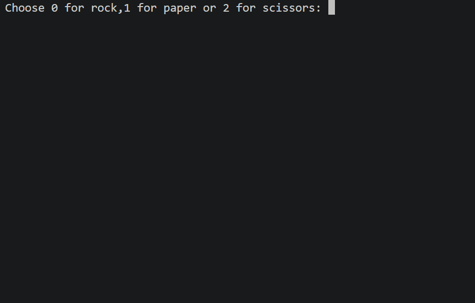

# 📅 Day 4 - Randomisation and Python Lists

## 🚀 Overview
On Day 4 of my #100DaysOfCode challenge, I built a **Rock Paper Scissors game** using Python.

This project focuses on using **randomisation** and **lists** to simulate a game between the user and the computer.

## 📚 Concepts covered in this project
- Python Lists
- Random module
- Conditional statements
- User input handling

## Rock Paper Scissors Game 🎮
## 🛠 How It Works
1. The user inputs a choice (0, 1, or 2)
2. The computer randomly selects its choice
3. The program compares both choices
4. The result is displayed (Win/Lose/Draw)

## 💻 Code
### [View Code](main.py)

## 🎥 Demo:

## 🧠 What I Learned

- How to use **lists** to store game options
- How to generate random choices for the computer
- How to build simple **game logic using conditions**
- Handling user input and validating it

## ⚡ Challenges Faced

- Writing the correct logic for all win/lose conditions
- Handling invalid user input
- Making the code clean and readable

## 🔥 Future Improvements

- Add a loop to allow multiple rounds
- Keep score (user vs computer)
- Add a graphical interface (GUI)