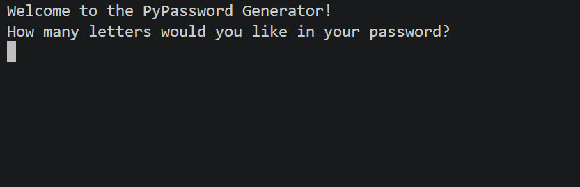

# 📅 Day 5 - Python Loops

## 🚀 Overview
On Day 5 of my #100DaysOfCode challenge, I created a password generator that allows users to specify the number of letters, numbers, and symbols they want in their password. The program then generates a random password based on the user's input and shuffles the characters to ensure randomness.

## 📚 Concepts covered in this project
- Using the for loop with Python Lists
- The random module and its functions
- For loops and the range() function
- String manipulation and concatenation

## 🔑 Password Generator

## 🛠 How It Works
1. The user inputs the number of letters, numbers, and symbols they want in their password
2. The program generates a password based on the user's input
3. The characters in the password are shuffled to ensure randomness
4. The final password is displayed to the user

## 💻 Code
### [View Code](main.py)

## 🎥 Demo:

## 🧠 What I Learned
- How to use the `random` module to generate random characters
- How to concatenate strings to build a password
- How to shuffle characters in a string using `random.sample()`
- The importance of creating secure passwords and how to implement that in code

## ⚡ Challenges Faced
- Ensuring that the password is truly random and not in a predictable order
- Handling user input and converting it to the correct data types

## 🔥 Future Improvements
- Adding more options for password complexity (e.g., uppercase, lowercase, numbers, symbols)
- Implementing a password strength indicator
- Allowing users to save their generated passwords to a file or database

## 📌 Conclusion
This project was a great exercise in using loops, lists, and the random module to create a practical application. It reinforced my understanding of how to manipulate strings and generate random data in Python. I look forward to building more complex projects in the future!
