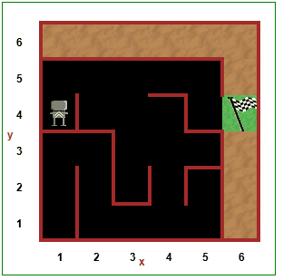

# 📅 Day 6 - Python Functions and Control Flow

## 🚀 Overview
On Day 6 of my #100DaysOfCode challenge, I tackled two exciting projects: Huddles in Reeborg's World and a Maze Solving algorithm. Both projects allowed me to apply my knowledge of loops, functions, and problem-solving skills in Python. The Huddles project involved programming a robot to move in a specific pattern.

## 📚 Concepts covered in this project
- Loops (for and while)
- functions
- Conditional statements (if-else)
- Problem-solving and algorithm design

## Escaping the Maze

## 🛠 How It Works
1. Reeborg starts at the entrance of the maze.
2. It checks for walls in front, to the left, and to the right.
3. Based on the presence of walls, Reeborg decides whether to move forward, turn left, or turn right.
4. The process continues until Reeborg reaches the exit of the maze.

## 💻 Code
### [View Code](main.py)

## 🎥 Demo:

## 🧠 What I Learned
- How to use loops and conditional statements to control the flow of a program
- The importance of breaking down a problem into smaller, manageable parts
- How to implement a simple algorithm to solve a maze

## ⚡ Challenges Faced
- Figuring out the correct sequence of movements for Reeborg to successfully navigate the maze
- Debugging the code to ensure that Reeborg correctly identifies walls and makes the right decisions

## 🔥 Future Improvements
- Implementing a more complex maze with multiple paths and dead ends
- Adding a feature to track Reeborg's path through the maze

## 📌 Conclusion
Overall, Day 6 was a great learning experience that allowed me to apply my coding skills in a fun and interactive way. I enjoyed the challenge of programming Reeborg to navigate through the maze and look forward to tackling more complex problems in the future!